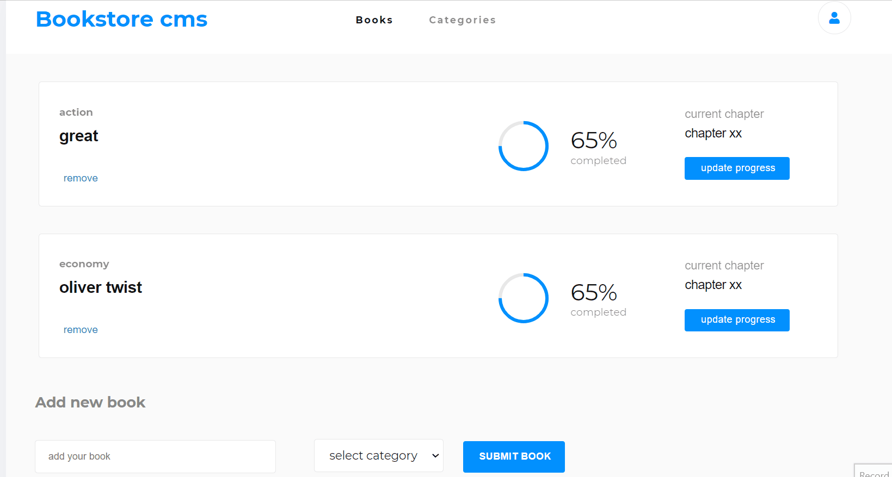
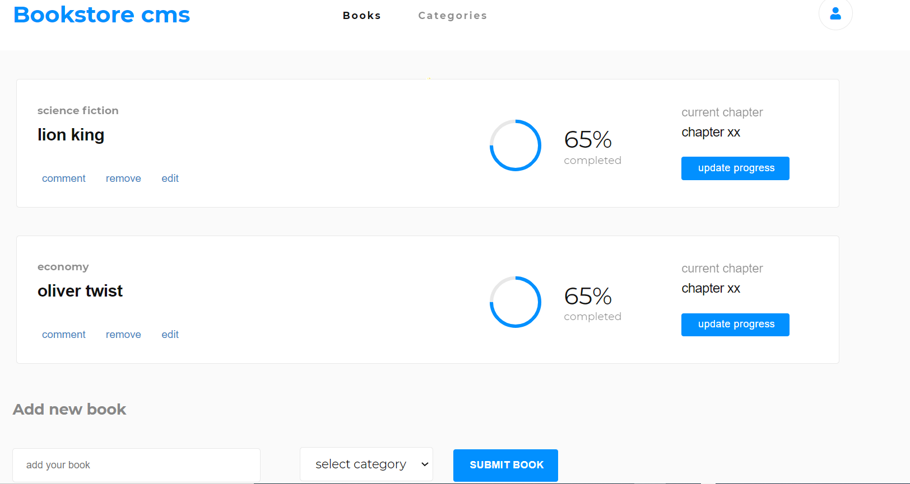

# bookstore

## Description
> this is a web application built using react and redux to keep track of the list of books in an online store

Demo view                                |  Static view
:---------------------------------------:|:---------------------------------------:
             |  


## Built With

- jsx
- css
- react
- redux

## Procedure to clone project
- open your terminal
- type ```git clone https://github.com/xtrahuman/bookstore.git```
- type ```cd bookstore``` to change directory to the folder of the project
- in your terminal ```npm install``` to install app dependencies
- run ```npm start``` in your terminal 


## project link
kindly click the link below to view the website
- website link: [click here](https://suspicious-swirles-06edff.netlify.app/)

## Author

👤 **Okpara Tochukwu**

- GitHub: [@xtrahuman](https://github.com/xtrahuman)
- LinkedIn: [LinkedIn](https://linkedin.com/in/tochukwu-okpara-449528197)


## 🤝 Contributing

Contributions, issues, and feature requests are welcome!

Feel free to check the [issues page](../../issues/).

## Show your support

Give a ⭐️ if you like this project!


## 📝 License

This project is [MIT](./MIT.md) licensed.
